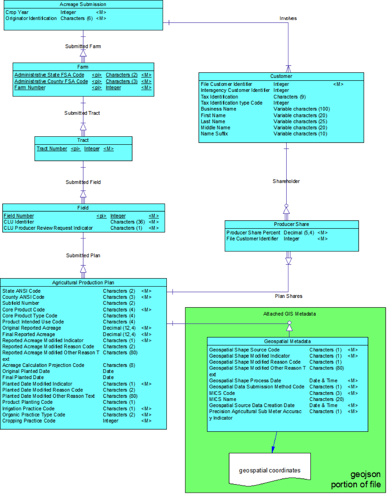

These are the __proposed__ data elements for Acreage Reporting to USDA.  No production development
should currently be done based on standards here.  For more information, please see [roadmap](data-standards/roadmap.html) or provide [feedback](data-standards/contribute.html).

**Quick Jumps**  

*  [Acreage Crop Reporting Business Case Documentation](about-acrsi.html)  
*  [Proposed XML Schema](https://github.com/bbrotsos/data-standards/tree/master/ag-acrsi.iepd)  
*  [Proposed JSON Schema](https://github.com/bbrotsos/data-standards/tree/master/json-schema)  
*  [Examples](https://github.com/bbrotsos/data-standards/tree/master/examples)  
*  [Acreage Crop Reporting Business Rules](data-elements/business_rules.html) 
*  [XML - JSON Mappings](#xml_json) 

###About ACRSI
Acreage Crop Reporting Streamlining Initiative (ACRSI) officially started in July 2010. By streamlining and 
automating reporting, ACRSI will reduce the burden on the producer to participate in USDA programs while 
simultaneously improving program integrity and data sharing across USDA agencies and programs. 
Ultimately, ACRSI will allow automated reporting from the producer’s precision farming equipment or 
farm management system.  

###Purpose
This document represents a readable form for the metadata for the entities and attributes included in the 
Logical Data Model for the ACRSI acreage report transmission.

###Common Acreage Reporting Transmission (CART)

This file is used to transmit an acreage report from an FSA County Office, an Approved Insurance Provider 
(AIP), or a producer to the Common Information Management System (CIMS) Clearinghouse.    

####1.3.1	Specifications  
The CART file is a JavaScript Object Notation (JSON) formatted file with optional embedded GeoJSON 
elements for spatial components. JSON standards can be found at
 https://google-styleguide.googlecode.com/svn/trunk/jsoncstyleguide.xml or more generally at json.org. 
 GeoJSON standards can be found at http://geojson.org/geojson-spec.html. 
 Currently, only polygons, including “inclusion” polygons (sometimes called ‘donuts’) are accepted.  
 
####1.3.2	Submission  
Reference document, “ACRSI RMA Intake Service” for detailed information on connecting to the web services,
 submitting the file with appropriate header information, and return file information.
 
####1.3.3	Common Acreage Report Transmission (CART)  
Reference document, “ACRSI Transmission File - Rules” for detailed information on validations performed by 
the Clearinghouse

<a name="xml_json"/>

**XML/JSON Mapping**
<table class="table table-striped">
   <thead>
      <tr>
          <th>Element Name</th>
          <th>XML Name</th>
          <th>JSON Name</th>
      </tr>
    </thead>
    
        <tr>
				<td><a href="data-elements/{{ data_element.page_name }}.html">{{ data_element.name }}</a></td>
				<td>
					{{ data_element.xml_name }}
				</td>
				<td>{{ data_element.json_name}}</td>
		</tr>
		
</table>
    
    

